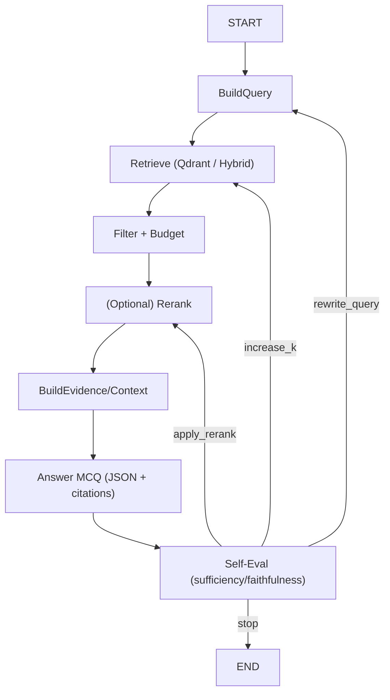

# Loop agentico (LangGraph)
Status: Roadmap (target)  
Scope: agentic retrieval loop  
Source of truth: `docs/requirements.md`

Il sistema target implementa un loop agentico “leggero” per migliorare il retrieval quando la prima passata non produce evidenza sufficiente.

## Stato (AgentState) - campi minimi
- `question` (stem + opzioni)
- `query` (corrente)
- `retrieved_docs` (lista con score + metadata)
- `context` (string/buffer costruito)
- `answer_json` (predicted_label, citations, reasoning)
- `self_eval` (score + suggested_actions)
- `trace_id`
- `iteration` + `max_iterations`

## Azioni supportate (target)
- `rewrite_query`: riscrivi query e ripeti retrieval
- `increase_k`: aumenta k / amplia retrieval per rerank
- `apply_rerank`: applica reranker a un set piu' ampio
- `stop`: evidenza sufficiente, finalizza

## Criteri di stop (decisione)
- `max_iterations` fisso (default: 2 o 3).
- stop immediato se:
  - `citations` vuote o non valide (devono essere chunk_id nel contesto)
  - self-eval indica insufficienza non risolvibile con rewrite (es. corpus mancante)

## Diagramma (target)

## Note implementative
- LangGraph e' usato come state machine per rendere esplicite le transizioni e loggare ogni step.
- Ogni nodo deve produrre artefatti minimi (input/output) per audit e debugging.

